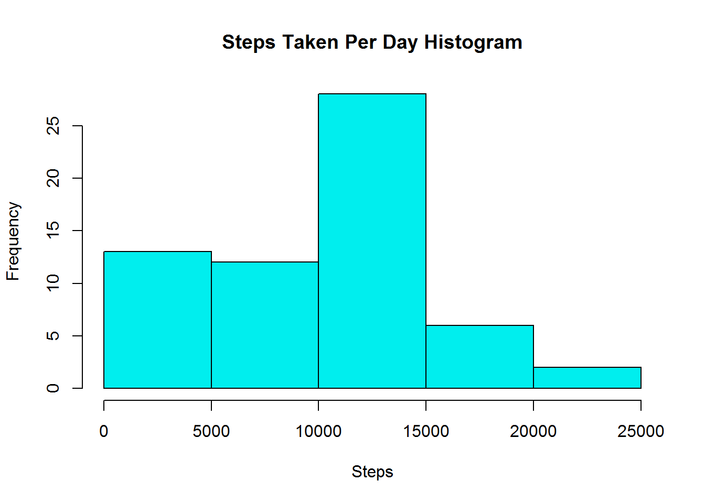
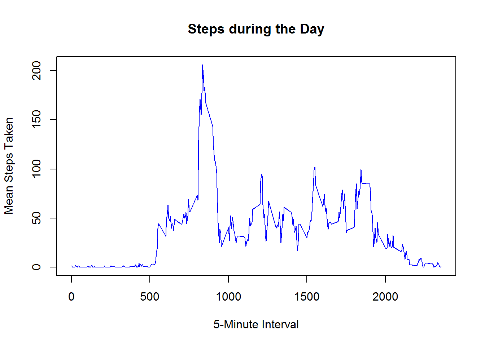
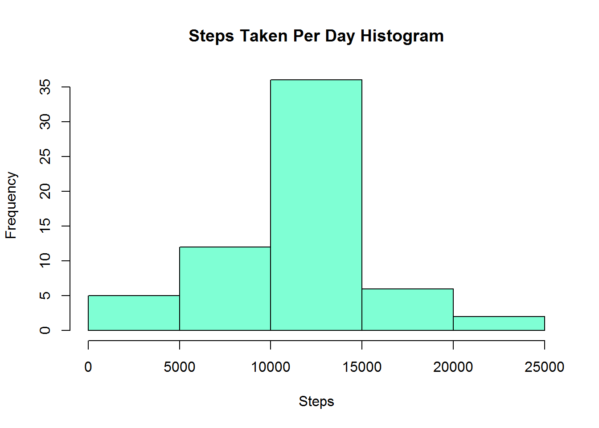
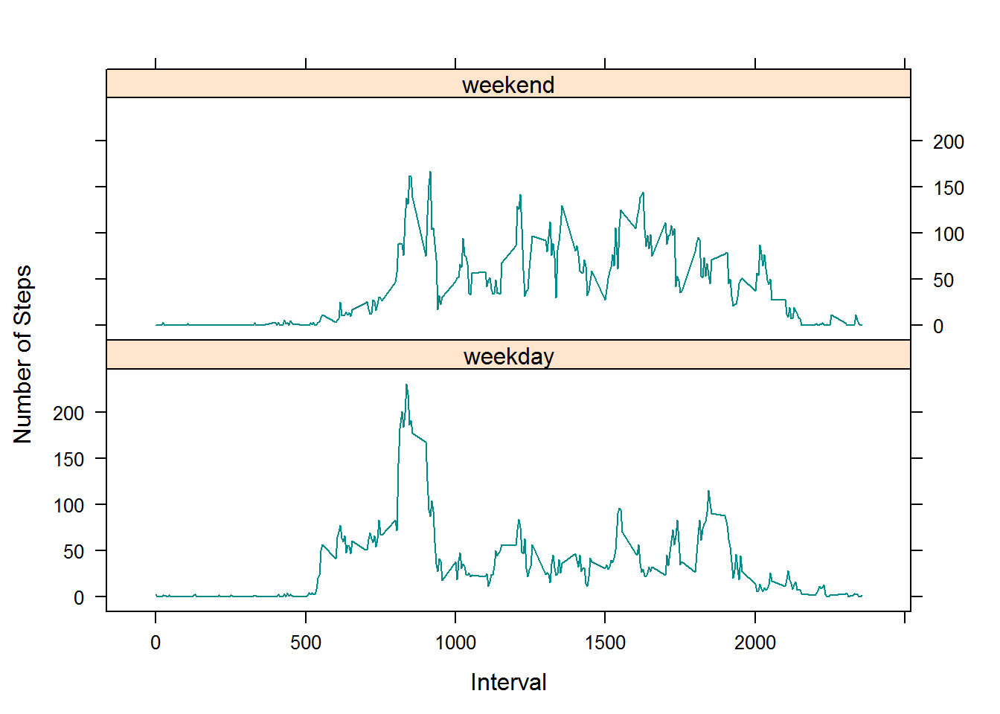

***

#### This is a Report created for the first Course Project in the Reproducible Research Course from John Hopkins University. 

**Note:-** All code is set to ECHO = TRUE for this report. 

##### The Data used is from the provided **'Activity Dataset'** that uses the data from a personal activity monitoring device. This device collects data at 5 minute intervals through out the day. The data consists of two months of data from an anonymous individual collected during the months of October and November, 2012 and include the number of steps taken in 5 minute intervals each day.

***

## Loading and preprocessing the data


To start off, we need to load the data into R for it to be available. The simple code below assumes that you have the activity file in your current Working Directory. In case this is not true, provide the complete file path. 


```r
activitydata <- read.csv("activity.csv")
```

We notice that there is no output for this code on the report, as there is nothing to print. 

***

## What is mean total number of steps taken per day?


As per requirement, we need to calculate the total number of steps per day and create a histogram. We also need the mean and median of the total number of steps taken per day.


To calculate the total number of steps, we sum the number of steps per day while *ignoring the NA values*. 


```r
stepSums <- aggregate(activitydata$steps, by = list(activitydata$date), sum, na.rm = TRUE)
```


The above code gives a set of 61 observations of 2 variables, we rename the variables to be more meaningful. 


```r
colnames(stepSums) <- c("Date", "Stepstaken")
```


Once the variables are named, we can use the information to create a histogram. 


```r
hist(stepSums$Stepstaken, xlab = "Steps", main = "Steps Taken Per Day Histogram", col = "cyan2")
```

<!-- -->

Once we have a daily number of steps available, we can find the mean and median based on the Stepstaken column. 


```r
stepmean <- mean(stepSums$Stepstaken)
stepmedian <- median(stepSums$Stepstaken)
stepmean
```

```
## [1] 9354.23
```

```r
stepmedian
```

```
## [1] 10395
```


***

## What is the average daily activity pattern?


To answer this question, we need to create a time series plot of the average number of steps taken.

To calculate the average steps per interval:


```r
intervalMeans <- aggregate(activitydata$steps, by = list(activitydata$interval), mean, na.rm = TRUE)
## Also rename the columns as above
colnames(intervalMeans) <- c("Interval", "Stepstaken")
```


To calculate the resulting time series, we use the plot function. 


```r
plot(intervalMeans$Interval,intervalMeans$Stepstaken,type="l", 
     
     xlab="5-Minute Interval",ylab="Mean Steps Taken",
     
     main="Steps during the Day", col = "blue")
```

<!-- -->

The next part of the question asks which interval had the maximum number of steps, which can be found using the code:


```r
max <- intervalMeans$Interval[which.max(intervalMeans$Stepstaken)]
max
```

```
## [1] 835
```


Thus the interval in which the maximum steps are taken is the interval number **835.**

***

## Imputing missing values

To find out the number of missing values in the data, we use:


```r
mv <- sum(!complete.cases(activitydata))
mv
```

```
## [1] 2304
```

Thus we see that the number of missing values is **`r mv'**

Let us use the startegy of replacing the missing values with the mean for the particular five-minute interval. 

First, we copy the data. 


```r
adata <- activitydata
```

To replace the missing values:


```r
## Calculate the mean over the given intervals
iMeans <- by(activitydata$steps, activitydata$interval, mean, na.rm = TRUE)

## Then match up the interval to replace the NAs

adata[!complete.cases(adata), 1] <- 
iMeans[as.character(adata[!complete.cases(adata), 3])]
```

Now, to recreate the earlier histogram, we use the new complete data set. 


```r
stepSums2 <- aggregate(adata$steps, by = list(adata$date), sum, na.rm = TRUE)
## Update column names
colnames(stepSums2) <- c("Date", "Stepstaken")
```

Once we have this information, we create a histogram with the detail. 


```r
hist(stepSums2$Stepstaken, xlab = "Steps", main = "Steps Taken Per Day Histogram", col = "aquamarine")
```

<!-- -->

Then, we calculate the new Mean and Median. 


```r
stepmean2 <- mean(stepSums2$Stepstaken)
stepmedian2 <- median(stepSums2$Stepstaken)
stepmean2
```

```
## [1] 10766.19
```

```r
stepmedian2
```

```
## [1] 10766.19
```


Not surprisingly adding in these imputed values increases both the mean and the median for the number of steps per day compared to the previously calculated values without the imputed data.

***

## Are there differences in activity patterns between weekdays and weekends?

We'd like to find out if there are any differences between weekday and weekend activity. So, we're going to add a factor variable to our data set with the filled-in missing values for weekends and weekdays.

First, let's just get the days of the week out of the date column:


```r
days <- weekdays(as.Date(adata$date))
```

Now let's divide that into weekends and not:


```r
weekends <- days == "Saturday" | days == "Sunday"
```

Then we'll transform the days vector into "weekend" or "weekday"


```r
days[weekends] <- "weekend"
days[!weekends] <- "weekday"
```

Finally, we'll add a factor variable to our data set with this information:


```r
adata$dayType <- factor(days)
```

To create our panel plot showing weekday vs weekend activity we need to aggregate the data to calculate the mean number of steps by type of day (i.e., "weekday" or "weekend") and by step interval:


```r
aggMeans <- aggregate(adata$steps, by = list(adata$interval, adata$dayType), mean)
## and add column names
colnames(aggMeans) <- c("interval", "dayType", "steps")
```

Finally, we want to create a panel plot of this data:


```r
library(lattice)
xyplot(aggMeans$steps ~ aggMeans$interval | aggMeans$dayType, aggMeans, type = "l", 
    layout = c(1, 2), xlab = "Interval", ylab = "Number of Steps", col = "darkcyan")
```

<!-- -->

The subject seems to walk more on the weekend and in the evening, while his way to work might involve more walking than wherever he is going on the weekend. Also, the sharper increase in activity on weekdays might indicate a more relaxed attitude toward early rising on the weekend.

***
***


